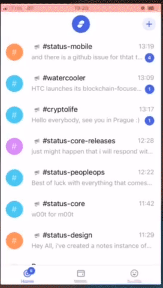

# Wrap Your Head Around a Better Web

## Meta data

The first step when extending Status is to create a skeleton extension with some relevant metadata:

```clojure
{meta {:name          "My extension name"
       :description   "My extension description"
       :documentation "Some more details can go there"}}
```

Metadata will be displayed to the end user before installing an extension.

## Hook

Hooks identify what part of status will be extended. Each hook has a unique identifier and a set of key/value elements specific to this hook.
An extension can implement several hooks.

## View 

Views must point to definition of UI in [Hiccup syntax](https://github.com/weavejester/hiccup/wiki/Syntax) using a combination of views, queries and events supported by status host.

More details can be found [here](https://status-im.github.io/pluto/docs/concepts/Anatomy.html).

`properties` data is accessed using [destructuring](https://status-im.github.io/pluto/docs/concepts/View.html#destructuring).
`text` and `view` are view elements available for all hosts.
`if` is a block providing conditional logic.

Our preview definition:

```clojure
{views/preview
 (let [{{{symbol :symbol token :token tx-hash :tx-hash} :params} :content outgoing :outgoing timestamp-str :timestamp-str} properties
        collectible-token [get-collectible-token {:symbol symbol :token token}]]
    [view {:flex-direction :column
           :align-items    :flex-start}
    [status/nft-token collectible-token]
    [view {:color          (if outgoing "#707caf" "#939ba1")
           :margin-top     6
           :font-size      12
           :flex-direction :row}
    [text "Sent at "]
    [text timestamp-str]]
    [status/send-status {:tx-hash tx-hash :outgoing outgoing}]])}
```

TODO string expansion

## Queries

## Events

# Playground

A [playground](https://status-im.github.io/pluto/try.html) is available to easily validate and publish and extension on IPFS. Just play with the building blocks in and click `PUBLISH` !

## Deploy

Extensions are identified by a URI and can be loaded in status via a universal link.

Currently only GitHub gist is supported as provider.

A universal link pointing to an extension would then look like: `https://get.status.im/extension/ipfs@Qm...`

## Install

The simplest option is to scan a QR code pointing to your extension. You can also navigate to status user profile and open the `Extensions` item in the `Advanced` section.
This option is only available in developer mode.

